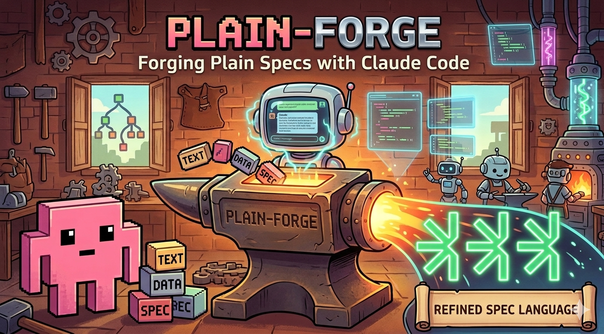

<p align="center">
  
</p>

# plain-forge

A conversational spec-writing tool powered by [Claude Code](https://claude.ai/claude-code) and the [***plain](https://plainlang.org) specification language. Describe what you want to build in plain English, and Plain Forge guides you through a structured interview to produce complete `.plain` spec files — which then generate production-ready code via the [Codeplain](https://codeplain.ai) renderer.

## How It Works

Plain Forge turns a conversation into software specs through four phases:

1. **What are we building?** — Define the product, users, and scope.
2. **What technologies?** — Choose language, framework, storage, and testing tools.
3. **How does it work?** — Detail entities, features, user flows, and business rules.
4. **Write the specs** — Plain Forge produces `.plain` files from your answers.

Each phase uses structured questions to eliminate ambiguity. You confirm the output of each phase before moving on.

## Getting Started

### Prerequisites

- [Claude Code CLI](https://docs.anthropic.com/en/docs/claude-code) installed and configured

### Usage

1. Clone this repo and `cd` into it.
2. Run `claude` to start a Claude Code session.
3. Tell Claude what you want to build — the QA workflow starts automatically.
4. Answer the questions. Plain Forge writes the `.plain` files for you.
5. Render specs into code using the Codeplain renderer.

## Repository Structure

```
CLAUDE.md                # Instructions that drive the QA workflow
PLAIN_REFERENCE.md       # Full ***plain language reference
.claude                  # Skills that are used during ***plain spec writing
```

## Available Slash Commands

Plain Forge ships with Claude Code skills for editing specs directly:

| Command | Description |
|---------|-------------|
| `/add-feature` | End-to-end: interview the user about a feature, then write all the specs |
| `/add-functional-requirement` | Add a feature spec to `***functional specs***` |
| `/add-implementation-requirement` | Add a non-functional requirement to `***implementation reqs***` |
| `/add-test-requirement` | Add a testing requirement to `***test reqs***` |
| `/add-concept` | Define a new concept in `***definitions***` |
| `/add-acceptance-test` | Add verification criteria under a functional spec |
| `/add-resource` | Link an external file (schema, API spec) to a spec |
| `/add-template` | Create or include a reusable Liquid template |
| `/create-import-module` | Create a shared template module (definitions + reqs, no functional specs) |
| `/create-requires-module` | Create a module that depends on a previously built module |
| `/analyze-if-func-spec-too-complex` | Check if a spec exceeds the 200-line complexity limit |
| `/analyze-2-func-specs` | Check two specs for conflicts |
| `/resolve-spec-conflict` | Resolve a conflict between two functional specs |

